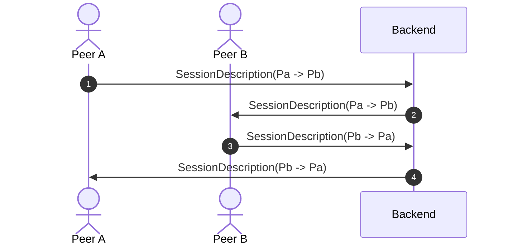

# Session Signaling

Lets assume two Wireguard peers $P_a$ & $P_b$ are seeking to establish a ICE session.

The smaller public key (PK) of the two peers takes the role of the controlling agent.
In this example PA has the role of the controlling agent as: $PK(P_a) < PK(P_b)$.




## Session Description

Session descriptions are exchanged by one or more the signaling backends via signaling _envelopes_ which contain signaling _messages_. 
The _envelopes_ are containers which encrypt the carried _message_ via asymmetric cryptography using the public key of the recipient.

Both the _envelope_ and the _message_ are serialized using Protobuf.

Checkout the [`pkg/pb/signaling.proto`](../pkg/pb/signaling.proto) for details.

## Backends

ɯice can support multiple backends for signaling session information such as session IDs, ICE candidates, public keys and STUN credentials.

### Available backends

- gRPC
- Kubernetes API server

For the use within a Kubernetes cluster also a dedicated backend using the Kubernetes api-server is available.
Checkout the [`Backend`](../pkg/signaling/backend.go) interface for implementing your own backend.

### Semantics

A backend must:

-   Allow the exchange of _envelopes_ between peers using their public keys.
-   Guarantee a reliable delivery of _envelopes_.
-   Not require not open _envelopes_ (require the knowledge of private keys).
-   May deliver the _envelopes_ out-of-order.
-   Shall be stateless (not buffer any _envelopes_ if the recipient is not yet know or reachable).

### Interface

All signaling backends implement the rather simple [`signaling.Backend` interface](https://github.com/stv0g/wice/blob/master/pkg/signaling/backend.go):

```go
type Backend interface {
	io.Closer

	// Publish a signaling message to a specific peer
	Publish(ctx context.Context, kp *crypto.KeyPair, msg *pb.SignalingMessage) error

	// Get a stream of messages from a specific peer
	Subscribe(ctx context.Context, kp *crypto.KeyPair) (chan *pb.SignalingMessage, error)
}
```