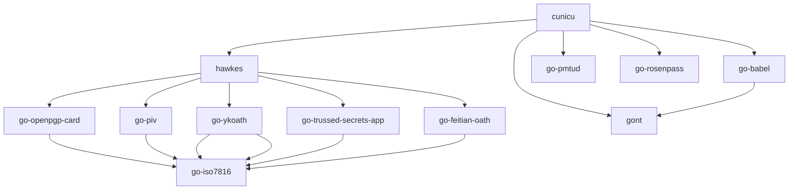

# Project Structure

This page summarizes the structure of the cunicu project and its related sub-projects:

```mermaid
graph TD
    cunicu --> hawkes
    cunicu --> gont
    cunicu --> go-pmtud
    cunicu --> go-rosenpass
    cunicu --> go-babel

    go-babel --> gont

    hawkes --> go-openpgp-card
    hawkes --> go-piv
    hawkes --> go-ykoath
    hawkes --> go-trussed-secrets-app
    hawkes --> go-feitian-oath
    
    go-ykoath --> go-iso7816
    go-piv --> go-iso7816
    go-ykoath --> go-iso7816
    go-openpgp-card --> go-iso7816
    go-trussed-secrets-app --> go-iso7816
    go-feitian-oath --> go-iso7816

    click cunicu href "https://github.com/cunicu/cunicu" "GitHub Repo"
    click hawkes href "https://github.com/cunicu/hawkes" "GitHub Repo"
    click gont href "https://github.com/cunicu/gont" "GitHub Repo"
    click go-pmtud href "https://github.com/cunicu/go-pmtud" "GitHub Repo"
    click go-rosenpass href "https://github.com/cunicu/go-rosenpass" "GitHub Repo"
    click go-babel href "https://github.com/cunicu/go-babel" "GitHub Repo"
    click go-piv href "https://github.com/cunicu/go-piv" "GitHub Repo"
    click go-ykoath href "https://github.com/cunicu/go-ykoath" "GitHub Repo"
    click go-iso7816 href "https://github.com/cunicu/go-iso7816" "GitHub Repo"
    click go-openpgp-card href "https://github.com/cunicu/go-openpgp-card" "GitHub Repo"
```
