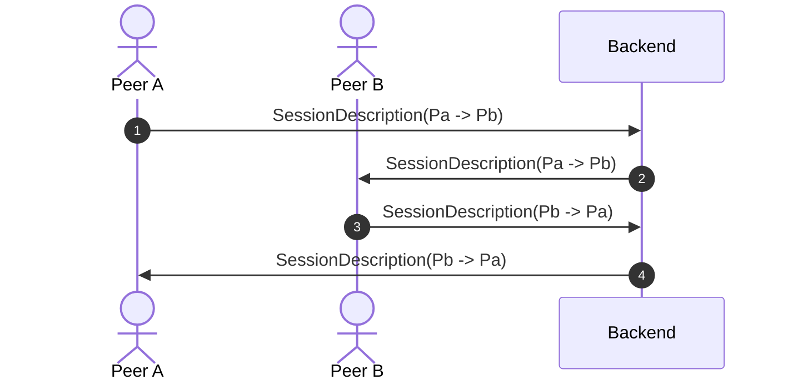
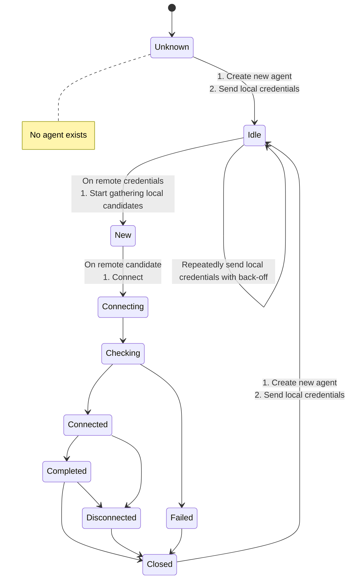

# Session Signaling

Lets assume two peers $P_a$ & $P_b$ are seeking to establish a ICE session.

The smaller public key (PK) of the two peers takes the role of the controlling agent.
In this example PA has the role of the controlling agent as: $PK(P_a) < PK(P_b)$.





## Session Description

Session descriptions are exchanged by one or more the signaling backends via signaling _envelopes_ which contain signaling _messages_. 
The _envelopes_ are containers which encrypt the carried _message_ via asymmetric cryptography using the public key of the recipient.

Both the _envelope_ and the _message_ are serialized using Protobuf.

Checkout the [`pkg/pb/signaling.proto`](https://github.com/stv0g/cunicu/blob/master/proto/signaling/signaling.proto) for details.

## Backends

cunīcu can support multiple backends for signaling session information such as session IDs, ICE candidates, public keys and STUN credentials.

### Available backends

-   gRPC
-   Kubernetes API server

For the use within a Kubernetes cluster also a dedicated backend using the Kubernetes api-server is available.
Checkout the [`Backend`](https://github.com/stv0g/cunicu/blob/master/pkg/signaling/backend.go) interface for implementing your own backend.

### Semantics

A backend must:

-   Must facilitate a reliable delivery _envelopes_ between peers using their public keys as addresses.
-   Must support delivery of _envelopes_ to a group of recipients (e.g. multicast).
-   May deliver the _envelopes_ out-of-order.
-   May discard _envelopes_ if the recipient is not yet known or reachable.
-   Shall be stateless. It shall not buffer or record any _envelopes_.

### Interface

All signaling backends implement the rather simple [`signaling.Backend` interface](https://github.com/stv0g/cunicu/blob/master/pkg/signaling/backend.go):

```go
type Message = pb.SignalingMessage

type MessageHandler interface {
	OnSignalingMessage(*crypto.PublicKeyPair, *Message)
}

type Backend interface {
	io.Closer

	// Publish a signaling message to a specific peer
	Publish(ctx context.Context, kp *crypto.KeyPair, msg *Message) error

	// Subscribe to messages send by a specific peer
	Subscribe(ctx context.Context, kp *crypto.KeyPair, h MessageHandler) (bool, error)

	// Unsubscribe from messages send by a specific peer
	Unsubscribe(ctx context.Context, kp *crypto.KeyPair, h MessageHandler) (bool, error)

	// Returns the backends type identifier
	Type() signalingproto.BackendType
}
```
